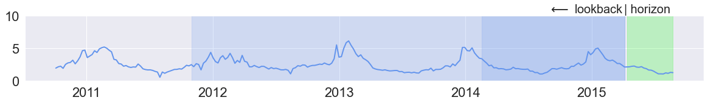
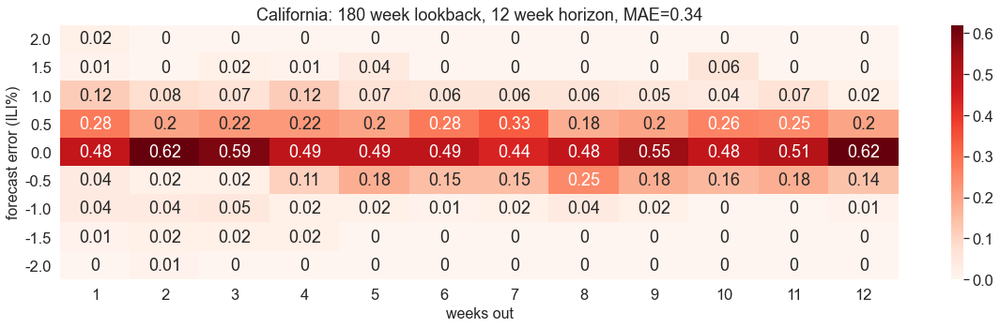

# seasonal-influenza-xyonix-blog
Source used to create XYONIX blog for time series forecasting of seasonal influenza via Neural Basis Expansion Analysis for interpretable Time Series forecasting (N-BEATS). 



# resources

* DATA
    * Influenza like illness data: https://www.cdc.gov/flu/weekly/index.htm
* XYONIX
    * main: https://www.xyonix.com
    * blog: https://www.xyonix.com/blog/using-ai-to-improve-sports-performance-amp-achieve-better-running-efficiency
    * blog source: https://github.com/xyonix/seasonal-influenza-xyonix-blog
* N-BEATS
    * article: https://arxiv.org/abs/1905.10437
    * source: https://github.com/philipperemy/n-beats


# installation

The blog was created using Python 3.8.0, which can be obtained from https://www.python.org/downloads/. Once you have Python3 installed, issue the following shell commands:

```
cd seasonal-influenza-xyonix-blog
make clean install run-jupyter
```

These commands will download and install the N-BEATS source into a `build/src` subdirectory and install the required Python modules into a `build/venv/xyonx-flu` virtual environment. After the notebook it launched, select the `xyonix-flu` kernel as illustrated below:


After installation, you will only need to issue `make run-jupyter` to continue experimenting with the Jupyter notebook. You can uninstall N-BEATS and delete the virtual environment by running `make clean`. 

# model training and evaluation

Run the cells in the `flu-foreacasting.ipynb` Jupyter notebook to train and evaluate selected N-BEATS state models. Near the end of the notebook, you should be able to create error heatmaps, like the one shown below, which illustrate the
efficacy of the model over a range of forecast horizons.


