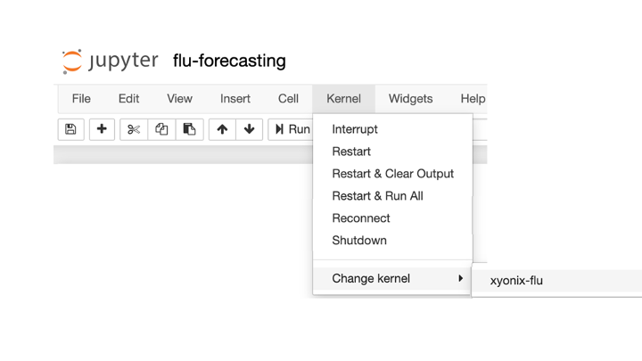

# seasonal-influenza-xyonix-blog
Source used to create XYONIX blog for time series forecasting of seasonal influenza via Neural Basis Expansion Analysis for interpretable Time Series forecasting (N-BEATS).

* XYONIX blog: https://www.xyonix.com/blog/using-ai-to-improve-sports-performance-amp-achieve-better-running-efficiency
* XYONIX blog source: https://github.com/xyonix/seasonal-influenza-xyonix-blog
* N-BEATS paper: https://arxiv.org/abs/1905.10437
* N-BEATS source: https://github.com/philipperemy/n-beats


# installation

```
make clean install
make run-jupyter
```

After launching the notebook, select the `xyonix-flu` kernel as illustrated below:

